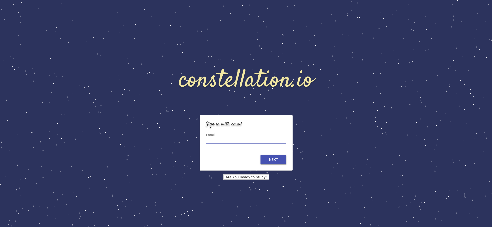
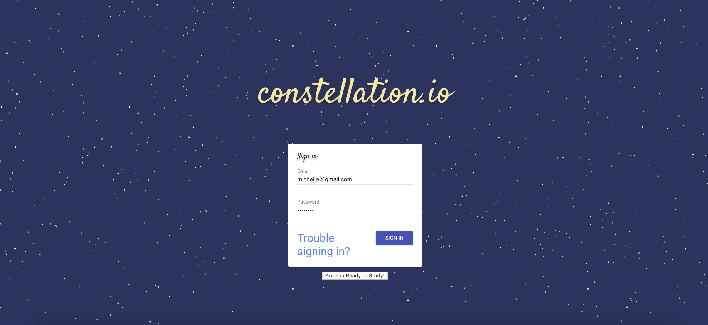
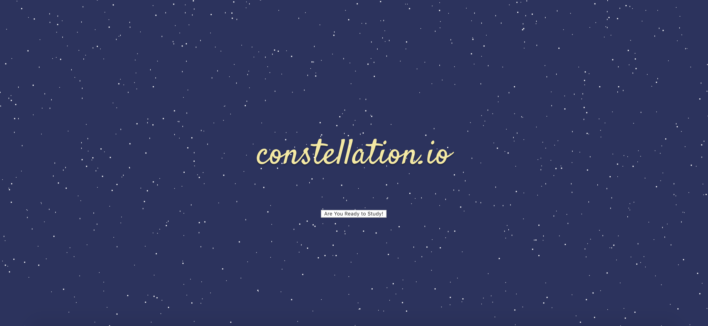
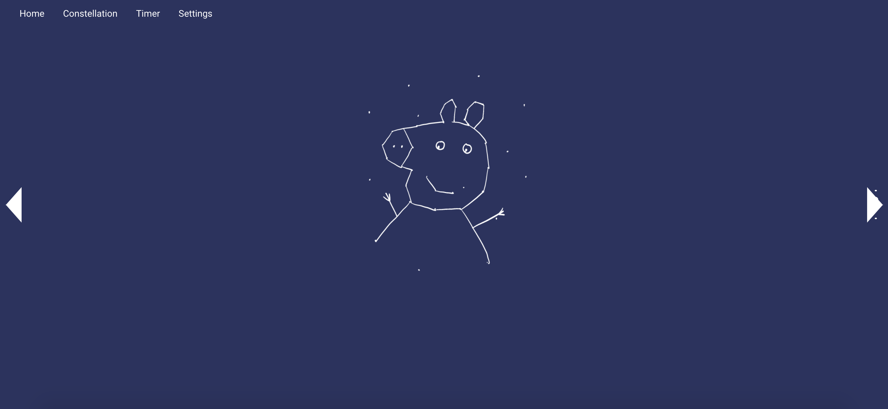
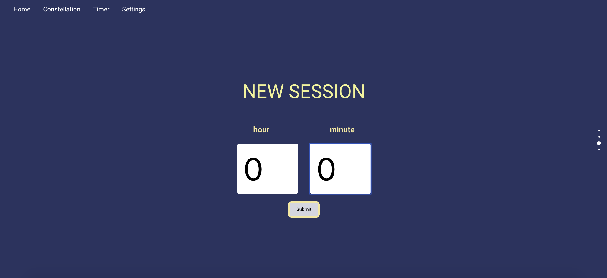
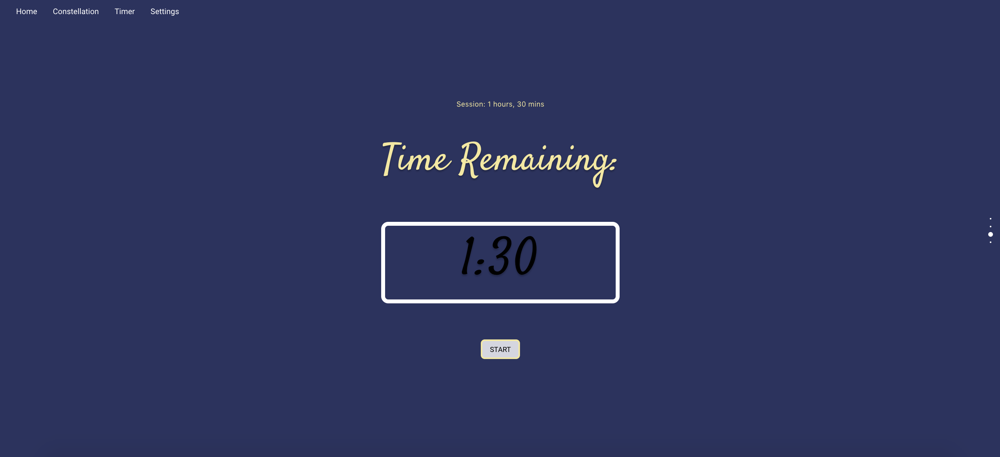
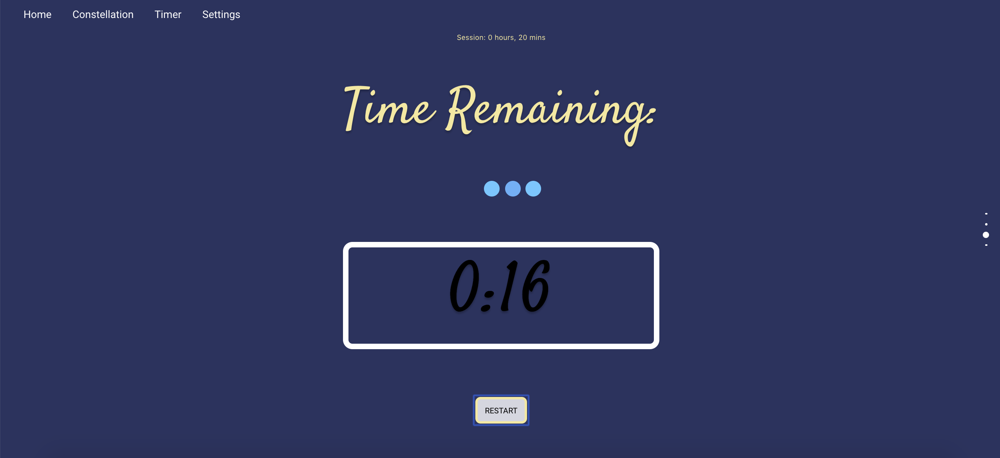
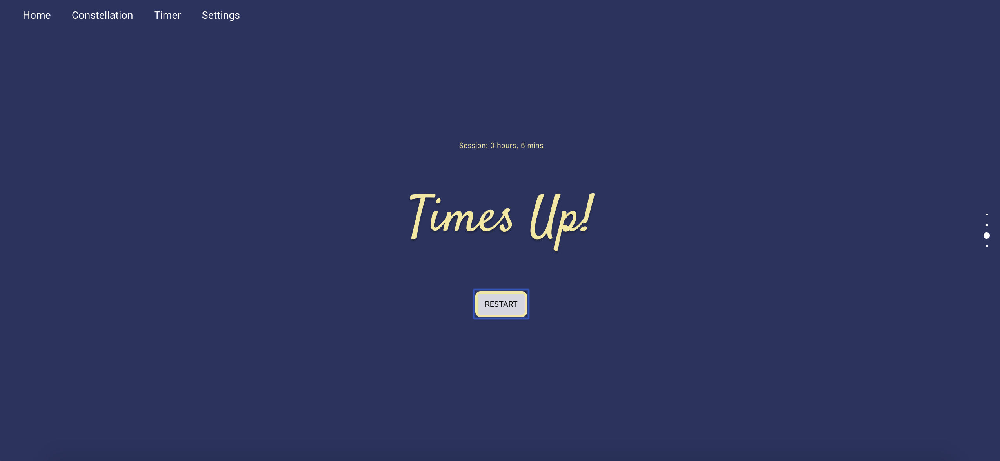
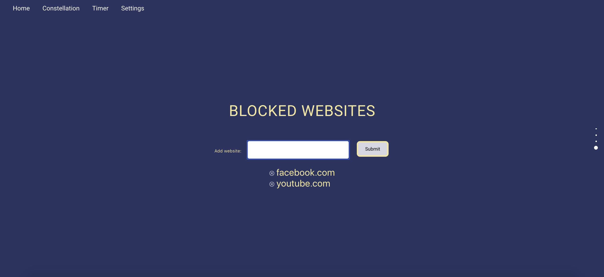
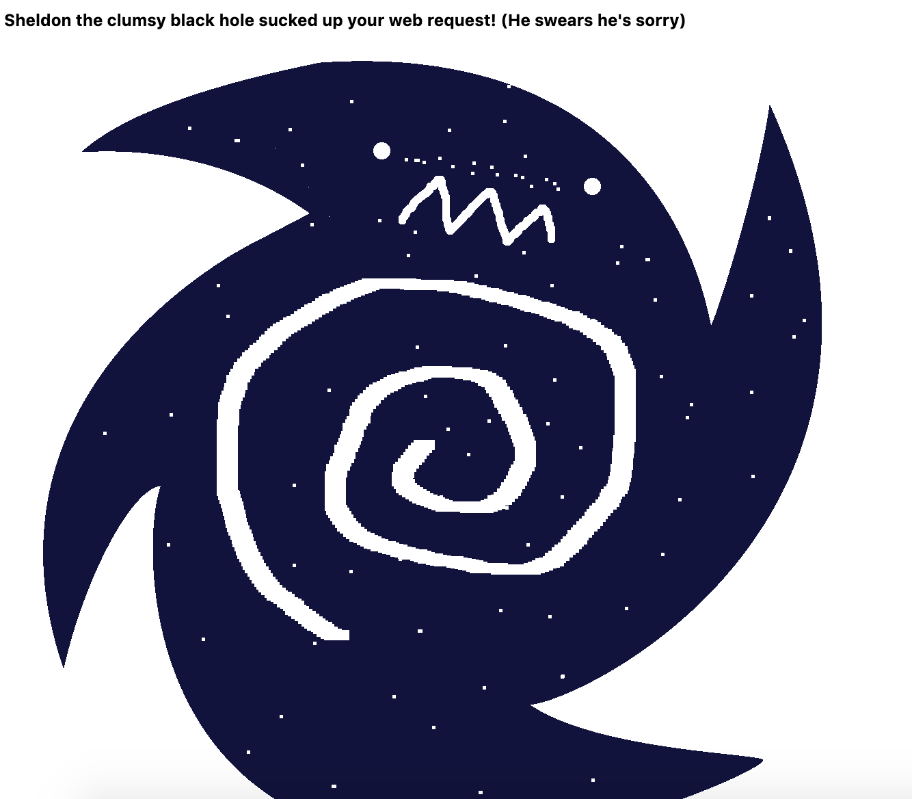

# CONSTELLATION.IO  | Codeology Spring 2020 Project
### Project Leaders: Anthony Zhou, Roshan Kumaraswamy 
### Developers: Ada Hu, Amy Huang, Michelle Lin, Satiya Kem, Vidya Ganga

#### Download Here: https://chrome.google.com/webstore/detail/constellationio/ibidmkkkcmllngiogmnccgclkfehbkfp

To run locally: 

Clone repo
### `npm install` 
### `npm run build`

In chrome://extensions (manage extensions), load unpacked and select the build folder. 
Then, just launch the app! 

## Learning Resources
The slides used for teaching and development are available here: http://bit.ly/constellationresources

## Primary Technologies Used
- React (HTML, CSS, JavaScript)
- Google Firebase (Authentication and Firestore)

## How the Extension Works

Upon running the web extension, you will prompted to sign in with your email.

Then you will be prompted for your password.  
  

Once you are logged in, go ahead an press the "Are You Ready to Study!" button.
  

The first page you will see is the home page. The entire webpage consists of 4 main components: home, rewards, timer, and settings. You can move between each component by using the navigation bar in the top left corner, scrolling through the webpage, or using the vertical slider on the right side of the page.  

#### Home Page  

  

#### Rewards Page  

  

#### Timer Page  
This is the timer page. To start a study session, go ahead and enter how many hours/minutes you want to study for.  Once you have set your timer, click submit.

  

You should now have a timer that will countdown your study session. 

  

This timer will keep track of how much time left you have of this study session. During this study session, you will not be able to access any of your blocked websites. If you need to access one of your study sessions, you can click restart and this study session will not count towards your rewards, but you will be able to access the blocked websites.  

  

At the end of your study session, the length of your study session will reflect in your rewards!  

  

#### Settings Page  

To add websites you want to block, enter the url into the form and press submit. To unblock websites, click the small x icon next to the url you want to unblock.  

  

If you try to access a blocked website during your study session, you will run into Sheldon the Clumsy Black Hole.  

  

